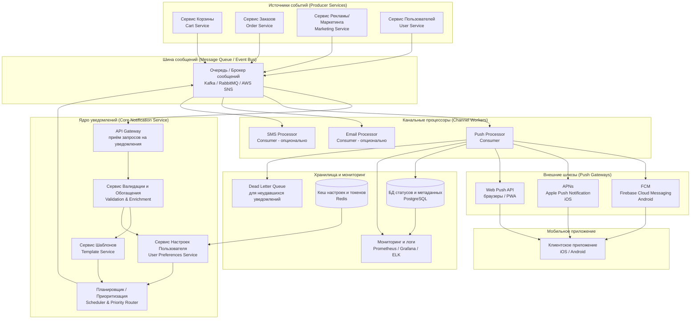

# Задание 3: Архитектура PUSH-уведомлений

## 1. Общая блок-схема архитектуры

```mermaid
flowchart TB
    subgraph "Источники событий (Producer Services)"
        A[Сервис Корзины<br>Cart Service]
        B[Сервис Заказов<br>Order Service]
        C[Сервис Рекламы/Маркетинга<br>Marketing Service]
        D[Сервис Пользователей<br>User Service]
    end

    subgraph "Шина сообщений (Message Queue / Event Bus)"
        MQ[Очередь / Брокер сообщений<br>Kafka / RabbitMQ / AWS SNS]
    end

    subgraph "Ядро уведомлений (Core Notification Service)"
        direction TB
        API[API Gateway<br>приём запросов на уведомления]
        VAL[Сервис Валидации и Обогащения<br>Validation & Enrichment]
        SCH[Планировщик / Приоритизация<br>Scheduler & Priority Router]
        TEM[Сервис Шаблонов<br>Template Service]
        PREFS[Сервис Настроек Пользователя<br>User Preferences Service]
    end

    subgraph "Канальные процессоры (Channel Workers)"
        PUSH_PROC[Push Processor<br>Consumer]
        EMAIL_PROC[Email Processor<br>Consumer - опционально]
        SMS_PROC[SMS Processor<br>Consumer - опционально]
    end

    subgraph "Внешние шлюзы (Push Gateways)"
        FCM[FCM<br>Firebase Cloud Messaging<br>Android]
        APNS[APNs<br>Apple Push Notification<br>iOS]
        WEB[Web Push API<br>браузеры / PWA]
    end

    subgraph "Мобильное приложение"
        APP[Клиентское приложение<br>iOS / Android]
    end

    subgraph "Хранилища и мониторинг"
        DB[(БД статусов и метаданных<br>PostgreSQL)]
        CACHE[(Кеш настроек и токенов<br>Redis)]
        MON[Мониторинг и логи<br>Prometheus / Grafana / ELK]
        DLQ[Dead Letter Queue<br>для неудавшихся уведомлений]
    end

    %% Потоки данных
    A --> MQ
    B --> MQ
    C --> MQ
    D --> MQ

    MQ --> API
    API --> VAL
    VAL --> TEM
    VAL --> PREFS
    PREFS --> SCH
    TEM --> SCH
    SCH --> MQ

    MQ --> PUSH_PROC
    MQ --> EMAIL_PROC
    MQ --> SMS_PROC

    PUSH_PROC --> FCM
    PUSH_PROC --> APNS
    PUSH_PROC --> WEB

    FCM --> APP
    APNS --> APP
    WEB --> APP

    PUSH_PROC --> DB
    PUSH_PROC --> MON
    PUSH_PROC --> DLQ

    DB --> MON
    CACHE --> PREFS
```
